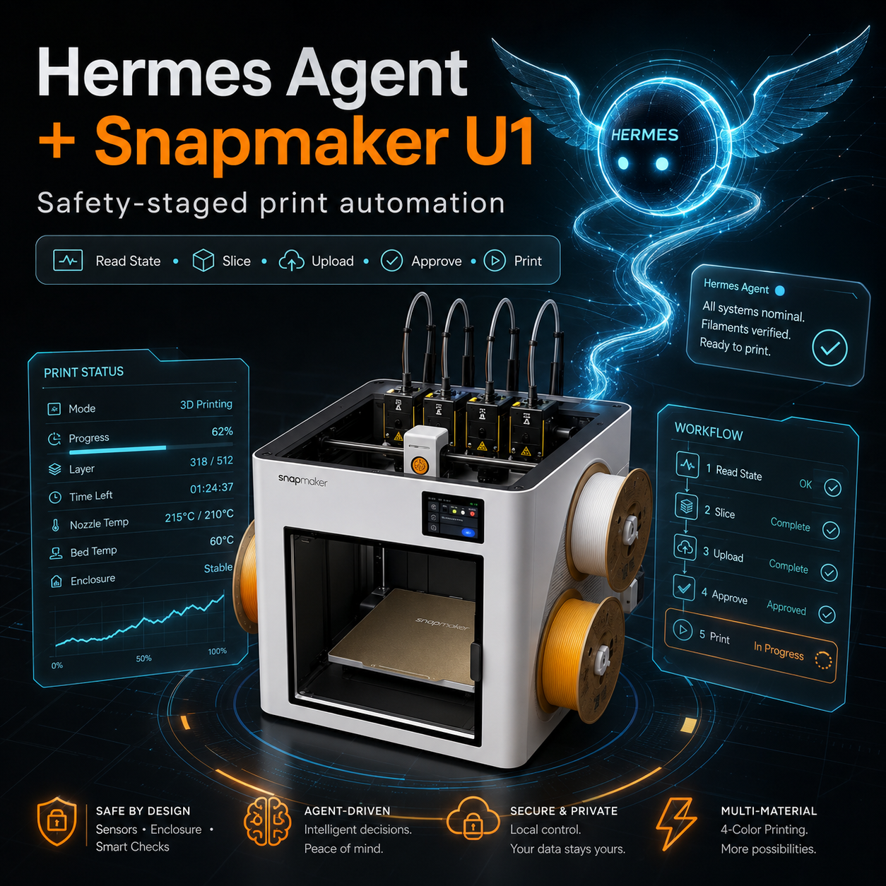
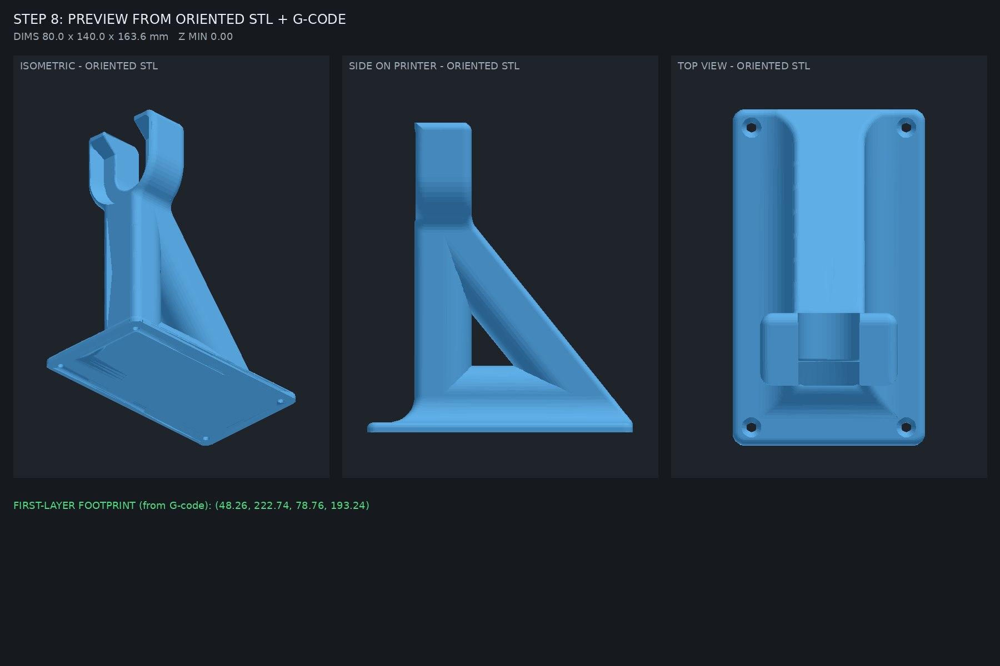
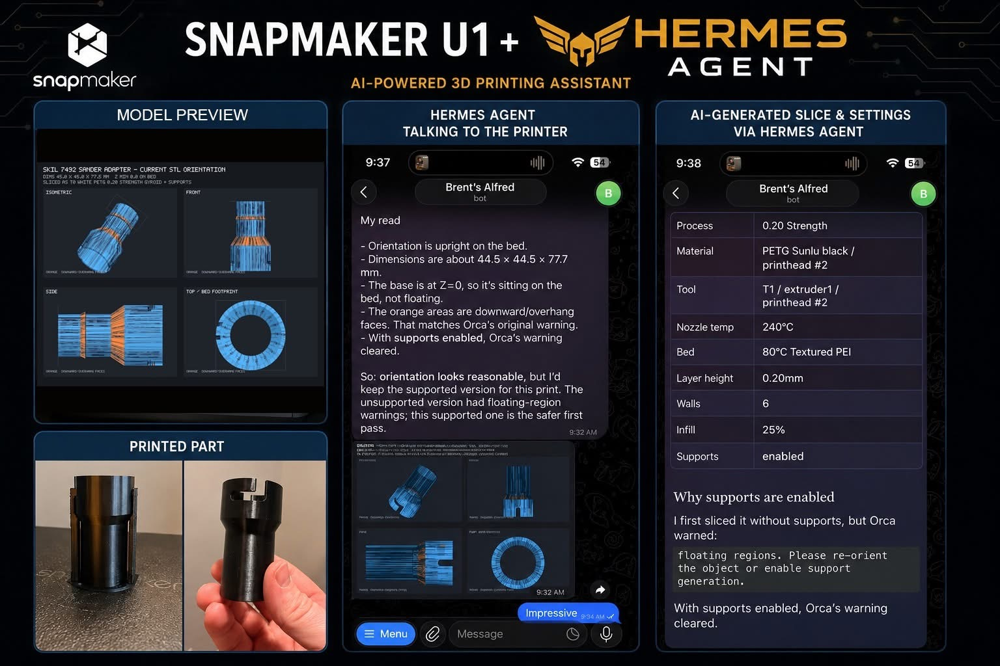

# Snapmaker U1 Toolkit

### Safe AI Print Operator — Snapmaker U1 first



[](https://github.com/bbolinger/snapmaker-u1-toolkit/actions/workflows/tests.yml)

> Inspired by safety-staged agent workflows, this project applies the pattern specifically to the [Snapmaker U1](https://snapmaker.com/snapmaker-u1) — local slicing, visual previews, camera-gated checks, and explicit operator approval. Useful from the command line on its own; an AI agent like Hermes is the optional remote-control layer on top.

This is how AI should touch physical machines: **plan, explain, preview, ask, verify, then act only within a narrow approved boundary.**

---

## See it in action

A single local model takes a zip of eight STLs all the way to a printing plate in
about 160 seconds (with local LLM), entirely over Telegram and entirely on local hardware.
Nothing starts until a human replies "yes."

https://github.com/user-attachments/assets/f3acea60-4ebe-4059-8158-92abd207f4ec

---

## The flow

One flow handles everything. Send a single STL or a zip of twelve — **a lone
model is just a kit of one**, auto-detected, same entrypoint, same safety
boundary:

1. **Send a model.** A `.stl`/`.3mf`, or a zip of STLs (the common Printables
   shape). The workflow ingests every part: footprints measured, oversized
   parts flagged, hostile archives refused with a clean error instead of a
   crash.
2. **Answer one decision form** — parts, print head, orientation, supports,
   profile. On a tool-capable model it renders as **native buttons** (one
   submit); on a small local model it falls back to a typed one-liner, or a
   staged one-question-per-turn flow. The form surfaces live U1 state (which
   filament is actually loaded on which head) and Orca's real mesh-topology
   verdict (`floating cantilever` / `clean` / overhang fraction) so you pick
   the pose Orca actually prefers. Either way **a script parses and validates
   the answer; the model never interprets it** — only an opaque form id rides
   through the model, and conflicting input fails loudly, never a silent guess.
3. **Arrange + slice** through OrcaSlicer onto as many plates as the bed
   needs — T0→T&lt;chosen&gt; rewriting, Snapmaker thumbnail injection, real
   Orca warnings surfaced, and a gcode-extent guard that refuses any plate
   whose extrusion would leave the bed (built from a real incident, not a
   hypothetical).
4. **Review two corroborating previews** derived from the *sliced gcode* (the
   real toolpath): a precise top-down footprint and a 3D plate view of the same
   per-part geometry with height added — same parts, same colors, same
   positions the printer will execute. Plus a `review.md` flight plan generated
   from the gcode's own config block: what will print, the ~12 settings that
   matter, your decisions and overrides.
5. **Upload** every plate to the U1's Moonraker storage with `print=false`
   (files land; the printer does NOT start).
6. **One bed-clear decision.** A fresh photo of the bed from the U1's onboard
   camera arrives with the previews. Reply YES to start now, or NO to keep the
   gcode uploaded without printing. The yes rides a single-use token bound to
   the plan's revision + gcode hash — if anything changed since you looked, the
   start refuses instead of printing stale state.
7. **Gated start with a last exit.** The gate re-verifies material against
   what's physically loaded, then opens a ~120s grace window with a model-free
   Telegram CANCEL before any command reaches the printer. Plate 1 is the only
   toolkit-started plate; plates 2..N start from the Snapmaker app — the
   watchdog photographs every plate either way.
8. **Monitoring takes over** — first-layer photo, last-layer check, completion
   (see [Always-on print monitoring](#always-on-print-monitoring--no-agent-required)).

Steps 1–5 are useful as CLI utilities even if you never touch an AI agent.
Steps 6–8 are where the operator gate makes the difference between "AI presses
print" and "AI safely shows you the print so you can press it."

## What This Is Not

- **It is not an autonomous printer driver.** No agent in this stack can start a print without an explicit operator yes/no. Normal starts are approved against a fresh U1 camera photo captured in-the-moment; if the camera is unavailable, the only alternative is an explicit, audited manual bed-verification path (never a silent skip).
- **It is not a generic slicer wrapper.** Specific profile resolution, T0→T<n> rewriting, Snapmaker thumbnail injection, and Moonraker storage discipline are baked in for the U1.
- **It is not a multi-printer abstraction yet.** The safety model and event contract are portable in principle. The implementation is U1-specific by design until the U1 experience is solid.
- **It is not a Hermes-only project.** Hermes is the convenient remote-control layer. Every workflow step has a CLI form and JSON event stream — wrap it with whatever you want.

## Safety Model

Hermes — and any other AI agent layered on top — can recommend, explain, and prepare a print, but the U1 toolkit owns the final safety checks and will not perform printer-affecting actions without an explicit operator approval tied to a specific request ID.

The default lifecycle:

```text
read state → slice → preview → upload-only → operator approval → start → monitor
```

Actions that always require explicit operator confirmation:

- Starting a print
- Resuming or canceling a print
- Heating nozzle or bed
- Moving axes
- Clearing alarms
- Changing tool state
- Anything that affects the physical printer

The workflow fails closed. If a check is unsure, it stops and asks rather than guessing. Bed-clear verdicts come from the operator looking at a real photo, not from the toolkit deciding the bed is "probably fine." Slicer profile mismatches abort BEFORE the slice. Upload that hits a filename collision asks before overwriting.

### What the operator approves

Every operator decision is concrete and tied to a specific artifact:

| Decision | What the operator sees |
|---|---|
| Parts / orientation | Parts thumbnail grid + Orca's mesh-topology verdict for the recommended pose |
| Tool / filament | Live U1 toolhead state ("T0: Generic white PETG (loaded)") |
| Preset | Recommended profile based on model class + your print history |
| Supports | Overhang verdict from a fast draft slice — Orca's real call, not face-angle |
| Pre-print review | A `review.md` flight plan generated from the sliced gcode's own config block — bound to the plan's revision + hash so what you read is what prints |
| **Bed clear** | A **real, fresh photo** of the bed from the U1's onboard camera. One yes/no. Default is no. |

If anything is unknown — printer state, tool, material, slicer metadata, bed visibility — the workflow stops and asks. No silent assumptions.

What the exchange actually looks like after the form is submitted:

> **Bot:** *(plate preview, 3D view, review.md, and a fresh bed photo arrive)*
> Sliced plate, review doc, and a fresh bed photo are attached. Bed clear and ready to print? Reply YES to start now, or NO to keep the gcode uploaded without printing.
>
> **You:** yes
>
> **Bot:** ⚠️ Snapmaker U1 print starting in 120s. Reply **CANCEL** to abort. Ignore this to let the print start.

If a re-slice or plan change happened between the photo and the "yes," the start refuses and re-asks with the new revision instead of starting on stale state.

The full per-action breakdown (the test-operator fence, the grace-period
cancel chain, and every allowed-vs-gated command) lives in
[docs/SAFETY.md](docs/SAFETY.md).

None of this is aspirational: 710 tests run in CI on every change, and the
cancel chain is **live-verified on real hardware**, including a reproducible,
no-printer-needed drill anyone can run:
[docs/verify-cancel-hook.md](docs/verify-cancel-hook.md).

## Always-on print monitoring — no agent required

The start decision needs an LLM + your explicit approval. **Watching the print once it's running does not** — that part is three quiet cron jobs, no agent turn, no LLM in the loop at all.

**Why first-layer specifically matters:** it's the earliest real tell a print is about to fail — bed adhesion problems, warping, a shifted part, wrong Z-offset all show up in the first few layers, long before you'd otherwise notice. A last-layer photo confirms it finished; a first-layer photo is the one that could actually save you hours of wasted filament and time if you catch it early.

| Job | Cadence | What it does |
|---|---|---|
| `u1_last_layer_watch.py` | every 1 min | Snaps a photo at **first-layer** (layers 2–5, the bed-adhesion check), at **last-layer** (final ~6 layers), and after a **pause/resume** (an extra confidence check). Delivers each straight to Telegram. Auto-dims the cavity LED a few minutes after the job completes/errors/cancels. |
| `u1_print_watchdog.py` | every 5 min | Silent health poll across *any* active U1 print, not just Hermes-started ones. Alerts once per distinct issue, with cooldown so it never spams. |
| `u1_print_history.py` | every 5 min | Appends to a durable print ledger. |

All three run in Hermes' `no_agent` cron mode — a plain script invocation with no persona and no model call, so there's nothing for a weak or a strong model to get wrong, and nothing that can fabricate a milestone that didn't happen (the photo either exists or the job says nothing). They watch *every* active print, whether it was started through this toolkit, the Snapmaker app, or anything else touching the same Moonraker.

## The Three Layers

The toolkit ships as three layers that build on each other. Pick your mode,
then install below.

### 1. CLI mode — useful without Hermes

Scriptable, deterministic, single-purpose tools that a U1 owner can use directly:

- Slice + preview a model
- Inspect printer state, profiles, print history
- Generate orientation renders
- Upload a job with `print=false`
- Review G-code metadata before printing

These are designed for shell scripts, cron jobs, manual workflows. No AI required.

### 2. Operator workflow — the staged experience

A multi-step state machine that walks an operator through the print decision. Emits structured JSON events at every step, so any frontend (Telegram bot, web UI, custom integration) can wrap it without re-implementing the logic.

This is the core product. It's what makes the toolkit feel like a responsible assistant instead of a generic API wrapper.

### 3. Hermes mode — the remote-control layer

A bundled Hermes skill (`3d-printer-slicing-automation`) that lets a Telegram-bridged Hermes agent drive the operator workflow on the user's behalf. The agent:

- Surfaces the workflow's questions and previews to the user verbatim
- Tool-calls the named scripts (never invents its own slicing path)
- Never decides bed-clear status on its own — the operator does, looking at a real photo

The skill is designed to work on small local models (`gemma4-26b-64k` and below) via [Ollama](https://ollama.com/). See [Hermes integration](#hermes-integration) for the full setup.

## Install

One install path. Everything below assumes a U1 reachable on your LAN.

**Requirements:** Python 3.9+, `numpy` + `Pillow` (via `requirements.txt`), an
[OrcaSlicer 2.4.0+](https://github.com/OrcaSlicer/OrcaSlicer) CLI binary
(extracted AppImage is fine — full steps in
[Headless slicing setup](#headless-slicing-setup-no-gui--scripted)), and network
reachability to your U1's Moonraker port (default `7125`).

```bash
git clone https://github.com/bbolinger/snapmaker-u1-toolkit.git
cd snapmaker-u1-toolkit
python3 -m pip install -r requirements.txt

# Point the toolkit at your printer (.env is auto-loaded on first config read)
cp .env.example .env       # edit: set SNAPMAKER_U1_HOST to your U1's LAN IP

# Fetch Snapmaker's stock U1 profiles (~217 files) + extract your own history
python3 tools/fetch_snapmaker_profiles.py
python3 tools/extract_profiles_from_printer.py   # optional but recommended

# Verify (argparse usage text = your environment is ready)
python3 scripts/u1_slice_workflow.py --help

# Read-only status probe (no risk)
python3 scripts/snapmaker_u1_status.py
```

On Windows (PowerShell) the same steps apply with `Copy-Item .env.example .env`
and backslash paths; the data dir defaults to
`C:\Users\<you>\.local\share\snapmaker-u1` (override with
`$env:SNAPMAKER_U1_DATA_DIR`).

**Choosing a Python interpreter.** The workflow needs `numpy` and `Pillow` on
the Python that runs it and auto-detects a working interpreter (first that can
`import numpy, PIL` wins): `$U1_TOOLKIT_PYTHON`, then
`/opt/hermes/.venv/bin/python`, then a project-local `venv`/`.venv`, then the
Homebrew paths. If none has the deps, it exits listing every path it tried and
how to fix it. Cleanest isolated setup:

```bash
python3 -m venv venv
venv/bin/pip install -r requirements.txt
export U1_TOOLKIT_PYTHON=$PWD/venv/bin/python   # add to your shell rc to persist
```

Connection, data-dir, and LED behavior are covered in
[Configuration](#configuration). If something fails, check
[TROUBLESHOOTING.md](TROUBLESHOOTING.md).

## First slice



The canonical entry point for a model or a kit zip (kit-of-one auto-detected):

```bash
python3 scripts/u1_slice_workflow.py model.3mf
```

Agent/Telegram wrappers should consume the event stream instead of
re-implementing the workflow:

```bash
python3 scripts/u1_slice_workflow.py model.3mf --json-events
```

Safe headless proof run — decisions passed as flags, upload-only, no printer
start (list your profile slugs with `python3 scripts/u1_profile_picker.py`):

```bash
python3 scripts/u1_slice_workflow.py model.3mf \
  --tool T1 --material PETG --orient auto \
  --profile 0_20_strength_snapmaker_u1_0_4_nozzle \
  --supports auto --upload-only --yes
```

Without profiles the workflow exits with a `setup_required` event and points
you back at the fetch/extract tools from [Install](#install).

For the design rationale, architecture, and acceptance criteria, see
[`docs/DESIGN-CONTRACT.md`](docs/DESIGN-CONTRACT.md). For the public event
contract (every event the workflow + audit log emit, with payload shapes), see
[`docs/events.md`](docs/events.md).

## Hermes integration

Hermes typically ships `numpy` + `Pillow` in its bundled venv (verify:
`/opt/hermes/.venv/bin/python -c 'import numpy, PIL; print("ok")'` — the
toolkit's interpreter auto-detection finds it). Then:

```bash
# 1. Install the bundled skill
hermes skills install bbolinger/snapmaker-u1-toolkit/skills/3d-printer-slicing-automation

# 2. Deploy the workflow scripts to the runtime paths the skill calls into
bash deploy_to_runtime.sh
```

The deploy script verifies the deployed workflow actually starts (`✓ workflow
starts cleanly`); override target paths via `U1_DEPLOY_SCRIPTS` /
`U1_DEPLOY_TOOLS` / `U1_DEPLOY_SKILL` / `U1_DEPLOY_PROFILES` if your layout
differs from the Hermes default.



The skill tells Hermes to call `scripts/u1_slice_workflow.py`, follow the
workflow's events, default to upload-only, and fail closed at the bed-clear
start gate.

### Local model & serving requirements (form mode / button UX)

The button-based **form mode** (the rich Telegram UX in the demo) asks the local
model to emit one tool call. Small local models are inconsistent at tool-calling,
so form mode has hard serving requirements — verified end-to-end on
`gemma4-26b-64k` via [Ollama](https://ollama.com/) on an NVIDIA Quadro P6000:

- **Ollama 0.31.1 or newer.** Ollama 0.30.x has a gemma4 tool-call parser bug
  ([#15539](https://github.com/ollama/ollama/issues/15539),
  [#15798](https://github.com/ollama/ollama/issues/15798),
  [#15943](https://github.com/ollama/ollama/issues/15943)): the model's tool
  call leaks into the message *content* as raw template tokens (`<|channel|>`,
  `<|"|>`), the parser misses it, `finish_reason` is `stop`, and the agent
  stalls with no buttons.

- **Run the model at low temperature (~0.2) for tool turns.** Gemma's default
  Modelfile ships `temperature 1`, which is unreliable for tool calls (~2 of 3
  succeed in testing — one run in three strands the operator). A temp-0.2 variant
  is 3 of 3. Create one (it shares the same weights blob — no extra disk):

  ```bash
  printf 'FROM gemma4-26b-64k:latest\nPARAMETER temperature 0.2\nPARAMETER num_ctx 65536\n' \
    | ollama create gemma4-26b-64k-tool -f -
  ```

  then point your agent's model at `gemma4-26b-64k-tool`.

- **The toolkit already does its part.** The `kit_form` event carries only a short
  `form_id`; the full form definition is persisted to disk and loaded by the form
  plugin, so the model never has to reproduce a large nested schema in its tool
  call (what small models fail at). Nothing to configure — just don't downgrade
  the bundled `u1-form` plugin.

All three are needed together: on 0.30.8 the model failed even with the flat
`form_id` call; on 0.31.1 the flat call works, but only at low temperature is it
reliable. If tool calls still fail, fall back to **text mode**
(`--interaction-mode text`) — the staged one-question-per-turn flow uses only
simple `terminal` calls that even small models handle reliably.

> **Hardware note (Pascal / older GPUs).** Ollama 0.31's `cuda_v13` runtime
> dropped Pascal (compute capability 6.1); it falls back to the bundled
> `cuda_v12`, so a P6000 / GTX-10-series still works today — but a future Ollama
> that drops `cuda_v12` would break it. Benign `driverInitFileInfo ... result=11`
> lines at startup are that fallback, not a failure.

### Gotcha for skill writers: Hermes attaches files via bare paths in text, not a tool parameter

If you fork this skill or write your own, Hermes' platform gateways (Telegram, Discord, Signal, etc.) deliver media to the user by scanning the agent's reply text for **bare absolute file paths** ending in known media extensions and auto-attaching whatever exists on disk. There is **no** `files=[...]` tool parameter the agent needs to call. See `gateway/platforms/base.py:extract_local_files()` in Hermes 0.15.2 for the canonical implementation.

What this means for your skill prompt:

- ✅ Tell the agent: *"emit the absolute path bare in your reply text"*
- ❌ Do NOT tell the agent: *"attach the file via the reply tool's files parameter"*
- ❌ Paths inside backticks or fenced code blocks are skipped — the agent must emit them as bare text

This caught me out during the first live test — the agent kept claiming it would "attach" renders but the gateway saw nothing to extract. See `TROUBLESHOOTING.md` for the full diagnosis if you hit the same.

## What's in here

| Script | What it does |
|---|---|
| `u1_config.py` | Centralized host/port resolution (env > JSON > default) |
| `u1_camera.py` | Camera capture via Snapmaker-specific websocket `camera.start_monitor`; auto-on/restore the cavity LED for each capture via `u1_led.photo_wrap` |
| `u1_led.py` | Cavity LED helper — CLI (`status / on / off / set --r/g/b/w / is-on`) and `photo_wrap()` context manager. The U1's cavity LED is white-only (`white_pin: PA10` in printer.cfg); the 4-channel API matches Klipper's interface, only WHITE has visible effect |
| `u1_toolmap.py` | Multi-tool material gate — declared vs detected material check |
| `u1_preflight.py` | Combined Moonraker state + camera freshness packet for "is it safe to start?" |
| `u1_upload_gcode.py` | Upload-only (`print_started=false`) with gates: idle state + tool/material match |
| `u1_slice_workflow.py` | Canonical end-to-end STL/3MF entry point: orient → render → slice → preview → upload-only/start gate |
| `u1_kit_workflow.py` | The unified kit workflow behind it — ingest, one decision form, arrange, slice, previews, bed-clear gate |
| `u1_last_layer_watch.py` | Watch active print for first-layer (2–5) and "last ~6 layers" milestones, snap photos; also auto-dims the cavity LED 5 minutes after `complete`/`error`/`cancelled` (`U1_LED_OFF_DELAY_SEC` overrides) |
| `u1_print_watchdog.py` | Quiet cron-driven health watcher with per-issue cooldown to avoid notification spam |
| `u1_print_history.py` | Append-only JSONL print ledger + canonical upserted JSON |
| `snapmaker_u1_status.py` | Read-only status probe |
| `snapmaker_u1_snapshot.py` | Websocket camera trigger helper |
| `tools/extract_profile_from_gcode.py` | One-shot extractor — turn a successful G-code into Snapmaker Orca process + filament JSONs |
| `tools/extract_profiles_from_printer.py` | Auto-pull recent G-codes off your U1 over Moonraker, run the extractor against each — one command, gets your real print history into `profiles/from-printer/` |
| `tools/fetch_snapmaker_profiles.py` | Fetch Snapmaker's official U1 stock profiles (machine + process + filament) from the upstream `Snapmaker/OrcaSlicer` GitHub repo into `profiles/snapmaker-stock/` |
| `tools/gcode_inject_thumbnail.py` | Add Snapmaker-app preview thumbnails to headless-sliced G-code (PIL renderer + base64 splice) |
| `tools/render_stl_orientation.py` | Pre-print orientation review — 4-view PNG (isometric, front, side, top) with overhang faces highlighted in orange |

## Configuration

`u1_config.py` resolves two things — the **connection** to the printer, and
the **data dir** where runtime state lives (configs, photos, ledgers).

### Connection (host/port)
1. **Environment variables**: `SNAPMAKER_U1_HOST`, `SNAPMAKER_U1_PORT`
2. **JSON file**: location from `SNAPMAKER_U1_CONFIG` env, default `<data-dir>/u1_config.json` (contains `{"host": "...", "port": 7125}`)
3. **Hardcoded default**: port 7125 only — host is required

### Data dir (where runtime artifacts live)
1. **`SNAPMAKER_U1_DATA_DIR`** env var (explicit override)
2. **`/opt/data/snapmaker_u1`** if it exists (auto-detects Hermes-style installs — for the agent setup these scripts came from)
3. **`~/.local/share/snapmaker-u1`** (community default, follows XDG Base Dir)

All host/port/data-dir lookups happen on first call — `import u1_toolmap` (or
any other script) never touches disk for config. The lookup only fails when
you actually run a command without any configuration.

See `.env.example` for a starting template.

### Cavity LED auto-control
The U1's `cavity_led` is white-only — Snapmaker's shipped `printer.cfg`
defines it as `[led cavity_led] / white_pin: PA10`, no R/G/B. Klipper's
`[led]` interface exposes all four channels regardless, but only the W
channel is physically wired. The toolkit drives the LED in two places
so the operator doesn't have to think about it:

- **Every camera capture** (`u1_camera.py photo`, and therefore every
  milestone photo from `u1_last_layer_watch.py`) is wrapped in a
  `u1_led.photo_wrap()` context manager:
  - LED already on → no change, no flicker.
  - LED off → turn on white (W=1), settle ~300 ms for the camera's
    auto-exposure, capture, then restore the LED to off.
- **5 minutes after a print finishes** (`print_state` enters `complete`,
  `error`, or `cancelled`) the LED is turned off, once per print. If you
  manually turn it back on, it stays on — the watcher dedups by
  `job_key = filename|total_layer` and won't re-fire for the same print.

**Tuning / disabling:**

- `U1_LED_OFF_DELAY_SEC=N` env var — grace window before auto-off. Default
  `300`. Set `0` for immediate. Set a large value (e.g. `86400`) to
  effectively disable the auto-off without removing the wiring.
- The wiring is **fail-soft**: if `cavity_led` isn't configured on your
  printer (or the LED endpoint errors), the LED helper logs to stderr and
  the photo/watcher keeps doing its primary job.
- Manual control via the CLI: `u1_led.py status / on / off / set --r --g --b --w`.

**Why:** photos taken at first/last-layer/post-resume milestones need
the LED on to be useful, but leaving the cavity bright forever after a
finished print is wasteful and surprising. The 5-minute grace gives you
time to inspect the bed before it goes dark.

## Optional: notify me when OrcaSlicer has an update

The toolkit ships a small checker that compares your installed `orca-slicer` version against the upstream latest release. **It does nothing unless you wire it into your scheduler.** Cloning the repo does not subscribe you to anything.

To enable, add one line to cron (Linux/macOS):

```
0 7 * * * /usr/bin/python3 /path/to/snapmaker-u1-toolkit/tools/check_for_updates.py
```

Behavior:
- **Silent when you're current.** No stdout → no cron email.
- **Single-line stdout when an update is available** — cron mails it via your usual cron-email setup. Example: `OrcaSlicer 2.4.1 available (you have 2.4.0). Patch (bug fixes, likely safe). Release notes: https://github.com/OrcaSlicer/OrcaSlicer/releases/tag/v2.4.1`
- **Refuses to query GitHub more than once per 24h** regardless of how often you invoke it (cache at `~/.cache/snapmaker-u1-toolkit/update-check.json`). `--force` overrides for one-off "tell me now" runs.
- **Returns silently when GitHub is unreachable or the binary isn't present.** Never breaks your cron with stray stderr.

Compatibility note: Snapmaker upstreamed the U1 vendor profile into OrcaSlicer 2.4.0, and `tools/fetch_snapmaker_profiles.py` pulls fresh stock profiles from that upstream — patch/minor upgrades should keep slicing U1 prints. Major-version bumps may change CLI flags or profile schema — re-run the EGO trimmer regression after upgrading. The notifier's risk label ("patch / minor / major") flags this in the alert text.

If your `orca-slicer` binary lives anywhere other than `/opt/data/tools/orcaslicer/squashfs-root/bin/orca-slicer` (Hermes-container default), pass the path explicitly OR set the `ORCA_SLICER_BIN` environment variable in your crontab, otherwise the script silently can't probe your installed version and you'll never see notifications.

CLI:

```
python3 tools/check_for_updates.py                                    # daily-cached check
python3 tools/check_for_updates.py --force                            # bypass cache, hit GitHub now
python3 tools/check_for_updates.py --orca-bin /path/to/orca-slicer    # one-off
ORCA_SLICER_BIN=/path/to/orca-slicer python3 tools/check_for_updates.py  # persistent env
```

## Reference docs

Real reverse-engineering notes from getting these scripts working — the kind of stuff Snapmaker doesn't document publicly:

| Doc | Topic |
|---|---|
| `references/snapmaker-u1-lan-probe-2026-06.md` | Open ports, working endpoints, API key handling |
| `references/snapmaker-u1-camera-websocket.md` | Snapmaker-specific `camera.start_monitor` websocket method |
| `references/snapmaker-u1-headless-slicing-and-toolhead-notes-2026-06.md` | OrcaSlicer CLI for headless slicing, tool naming gotchas |
| `references/snapmaker-u1-filament-detection-api-2026-06.md` | Filament presence/material detection objects |
| `references/snapmaker-u1-printhead-numbering-and-start-workflow-2026-06.md` | T0..T3 mapping to `extruder`..`extruder3` |
| `references/snapmaker-u1-last-layer-photo-watch-2026-06-21.md` | Last-layer event detection for milestone photos |
| `references/snapmaker-u1-toolmap-script-2026-06.md` | Material-gate design rationale |
| `references/snapmaker-u1-orca-moonraker.md` | OrcaSlicer + Moonraker integration |
| `references/snapmaker-u1-research.md` | First-pass research summary |

## Profile sources

Your profiles should be *yours*: extracted from your own successful prints,
mapped to your own extruders. The toolkit ships with an empty `profiles/` dir on
purpose and gives you three honest sources: Snapmaker's stock profiles
(`tools/fetch_snapmaker_profiles.py`), profiles extracted from prints that
already succeeded on your printer, and your own hand-tuned files. The full
guide (first-run setup, supports auto-detection, and building per-extruder
profiles from print history) is in [docs/PROFILES.md](docs/PROFILES.md).

## Headless slicing setup (no GUI / scripted)

Use this if you're slicing from CLI in a container, CI pipeline, or agent workflow.

### Use upstream OrcaSlicer, not the Snapmaker fork

> **Important**: use **upstream [OrcaSlicer](https://github.com/OrcaSlicer/OrcaSlicer)
> v2.4.0+**, not Snapmaker's fork. Snapmaker upstreamed the U1 vendor profile
> into upstream OrcaSlicer 2.4.0, so it has full U1 support — and its CLI is
> the better-supported headless path. The Snapmaker fork's Windows CLI has
> been observed to segfault when slicing with these profiles (verified
> `snapmaker-orca v2.3.4` Windows can exit code `-1073741819` on some models).

### Install — Linux (extracted AppImage)

```bash
# Download upstream OrcaSlicer Linux AppImage
wget https://github.com/OrcaSlicer/OrcaSlicer/releases/download/v2.4.0/OrcaSlicer_Linux_AppImage_Ubuntu2404_V2.4.0.AppImage \
  -O ~/orcaslicer.AppImage
chmod +x ~/orcaslicer.AppImage

# Extract instead of mounting (containers without FUSE)
mkdir -p ~/orcaslicer-install && cd ~/orcaslicer-install
~/orcaslicer.AppImage --appimage-extract
# Creates ./squashfs-root/

# Some minimal distros are missing GUI/runtime libs Orca expects.
# If you hit "libGL.so.1 not found" or similar:
mkdir local-libs && cd local-libs
apt-get download libgl1 libegl1 libxkbcommon0 libwayland-client0 libnss3 \
                 libasound2 libgtk-3-0 libdbus-1-3 libsecret-1-0
for d in *.deb; do dpkg-deb -x "$d" .; done
```

### Install — Windows (portable zip, no installer needed)

```powershell
# Download upstream OrcaSlicer Windows portable
Invoke-WebRequest -Uri https://github.com/OrcaSlicer/OrcaSlicer/releases/download/v2.4.0/OrcaSlicer_Windows_V2.4.0_portable.zip `
    -OutFile $env:TEMP\OrcaSlicer.zip
Expand-Archive $env:TEMP\OrcaSlicer.zip -DestinationPath $env:TEMP\orca240

# The CLI binary lives at $env:TEMP\orca240\orca-slicer.exe
```

### Slice a single STL — the 3-profile chain

Headless slicing needs **three** profiles in a specific load order:

1. **Machine** — the printer definition (this repo bundles a flattened standalone copy)
2. **Process** — layer height, walls, infill, supports
3. **Filament** — material, temps, retraction

> **Pass each profile via its own `--load-settings` flag** (not one flag with
> semicolon-separated paths). Both forms are documented in OrcaSlicer, but
> the dual-flag form is the one verified-working in our test runs (Hermes
> Windows) and avoids quoting foot-guns on PowerShell.

```bash
# Linux
ORCA=$HOME/orcaslicer-install
PROFILES=$(pwd)/profiles

LD_LIBRARY_PATH="$ORCA/local-libs/usr/lib/x86_64-linux-gnu:$ORCA/squashfs-root/usr/lib:$ORCA/squashfs-root/usr/lib/x86_64-linux-gnu:$LD_LIBRARY_PATH" \
  $ORCA/squashfs-root/bin/orca-slicer \
  --load-settings "$PROFILES/machine/snapmaker_u1_0_4_nozzle.json" \
  --load-settings "$PROFILES/community_merged_016_optimal_u1_textured_pei.json" \
  --load-filaments "$PROFILES/community_generic_petg_u1_textured_pei.json" \
  --outputdir ./output \
  --slice 0 \
  my_model.stl
```

```powershell
# Windows (PowerShell)
& "$env:TEMP\orca240\orca-slicer.exe" `
  --load-settings "profiles\machine\snapmaker_u1_0_4_nozzle.json" `
  --load-settings "profiles\community_merged_016_optimal_u1_textured_pei.json" `
  --load-filaments "profiles\community_generic_petg_u1_textured_pei.json" `
  --outputdir .\output `
  --slice 0 `
  my_model.stl
```

Sliced G-code lands in `./output/plate_1.gcode`.

> **Why the bundled machine profile?** Upstream Orca's bundled U1 profile
> inherits from `fdm_U1` → `fdm_toolchanger` → `fdm_klipper`. Loading the
> bundled vendor copy via CLI requires Orca to find every parent in its
> install resources, which is fragile across platforms. The repo's
> `profiles/machine/snapmaker_u1_0_4_nozzle.json` is **fully flattened**
> — every inherited field merged into one standalone file. Headless CLI
> sees one file, gets the complete machine definition, no resolution
> magic needed. Derived from upstream OrcaSlicer's `Snapmaker/machine/`
> vendor profiles (AGPL-3.0, contributed by Snapmaker).

### Headless profile-loading pitfall (READ THIS)

OrcaSlicer's bundled Snapmaker process profiles **do not always resolve inheritance correctly via CLI**. Symptoms seen in testing:

- `filament_settings_id` says PETG but `filament_type` becomes PLA → wrong temps
- Layer-height preset of 0.16 produces G-code with `layer_height = 0.2`
- Bed/nozzle temps default to PLA-safe values regardless of selected filament

**Workaround**: use profiles whose inheritance chain CLI can resolve. Three good options today:

- `tools/extract_profiles_from_printer.py` writes **flat process JSONs from your successful prints** (no inheritance) — physics-validated AND CLI-safe by construction. Best default.
- `tools/fetch_snapmaker_profiles.py` pulls Snapmaker's upstream stock — CLI resolves these against the bundled OrcaSlicer install when the install matches the stock branch.
- `examples/profiles/community_merged_*` (in `examples/`) is the legacy flat-profile shape; if you're handwriting your own, follow that pattern. The `_override` variants only work in the GUI where Orca resolves the official base profile. The same flatness logic applies to the bundled machine profile above.

### Pre-print orientation review

Before you slice, ask the question every operator forgets: *is this the right
orientation, and where will it need supports?* The orientation renderer
gives you a 4-panel image showing isometric / front / side / top views with
all downward-facing triangles highlighted in orange — those are the faces a
slicer will warn about.

```bash
pip install Pillow numpy  # one-time (same deps as the thumbnail tool)

python3 tools/render_stl_orientation.py model.stl \
    --out orientation.png \
    --title "Orbital sander vacuum attachment"
```

Output is a single PNG with header text (bounding-box dims, Z range, count
of overhang triangles) and the 4 views. Tunable via `--overhang-threshold`
if your slicer/material is more or less paranoid than the default (-0.3 ≈
17° below horizontal).

### Add a Snapmaker-app preview thumbnail

OrcaSlicer's CLI path doesn't render thumbnails (GUI-only — verified with `--debug 5`, no GL/xvfb workaround helps). Without them, the Snapmaker app shows a generic icon for every print. Use the included tool to splice PrusaSlicer/Orca-format thumbnail blocks into the G-code post-slice:

```bash
pip install Pillow numpy  # one-time

python3 tools/gcode_inject_thumbnail.py \
    --stl my_model.stl --gcode output/plate_1.gcode \
    --sizes 48x48,300x300 --in-place
```

Runs an isometric projection of the STL through PIL (Lambertian-shaded triangles, painter's algorithm), base64-encodes the PNGs, and splices `; thumbnail begin … ; thumbnail end` blocks into the G-code header. Idempotent — re-running replaces existing blocks, not stacks them. Moonraker + Snapmaker app parse them as standard previews.

### Validate G-code before upload

```bash
grep -E '^; (filament_type|layer_height|first_layer_temperature|bed_temperature) ' output/plate_1.gcode
```

Expected output for the merged 0.16 Optimal PETG profile:

```
; filament_type = PETG
; layer_height = 0.16
; first_layer_temperature = 255
; bed_temperature = 80
```

If any of those are wrong, the CLI didn't load your profiles correctly — fix before uploading.

## Running the tests

```bash
python3 -m venv .venv
source .venv/bin/activate
pip install pytest
pip install Pillow numpy   # only needed for the thumbnail-injector tests
pytest -v
```

710 tests covering: config resolution (incl. 3-tier data-dir, `.env`
auto-loader with quoted/commented/walk-up edge cases, import-without-config
regression lock, and a smoke-runner that exercises every script's `main()`
to catch leftover undefined refs), material gate (incl. fail-closed on
corrupt map), upload pre-checks, G-code metadata parsing, print-history
ledger (incl. atomic-write contract + tmpfile cleanup on failure), profile
extraction (incl. multi-tool slice handling — `PETG;PETG;PLA;PLA` →
right value for the actual tool), thumbnail injection, upload-time
thumbnail wiring, status-probe `safe_to_upload` parity with the actual
upload gate, preflight `--host` override correctness, STL parsing + view
rotations + overhang detection + 4-view orientation sheet rendering,
bundled machine-profile completeness (standalone, klipper gcode flavor,
4 extruders, required slicing fields), printer-side profile extraction
(Moonraker list + download mocked, friendly errors).

Tests use mocked Moonraker responses — no real printer required. The
thumbnail-injection tests `importorskip` PIL/numpy, so they're harmless
to omit if you only want to run the safety-script tests.

## Release validation

Each tagged release is validated before publish: the full test suite in CI on
Python 3.11 and 3.12, a fresh-clone install and script-help smoke test, the
active-print upload-gate safety check against a mocked Moonraker, and, for
releases that touch the safety boundary or the operator flow, a live run on a
real U1. Per-release evidence lives in the [CHANGELOG](CHANGELOG.md).

## Known limitations / design notes

1. **Single-printer scope**: scripts assume one U1. Multi-printer would need namespacing in the config + per-printer state dirs.
2. **Cron / always-on cadence**: the watchdog, last-layer, and history scripts are written to be cron-driven (the table above shows the defaults; the intervals are yours to set). They keep state on disk and are idempotent across runs, but they're not daemonized; your scheduler (cron, systemd timer, Hermes' cron, etc.) owns the cadence.
3. **U1 firmware coupling**: tested against Snapmaker U1 firmware on the version that ships Moonraker on port 7125. Other Snapmaker models, or future firmware revisions that change the `print_task_config` / `filament_detect` object shape, may surface field gaps. The `references/` docs capture what the current firmware does emit — start there if you're debugging a field-shape mismatch.

## License

MIT — see `LICENSE`.

## Contributing

PRs welcome, especially:
- Additional reference docs as new firmware behaviors are reverse-engineered
- Material gate enhancements (multi-tool prints, prime-tower extruder assignment)
- Multi-printer support (namespacing config + per-printer state dirs)

Please run `pytest` before submitting — all tests should pass. See
[CONTRIBUTING.md](CONTRIBUTING.md) for setup, conventions, and the
safety-model rules that PRs need to respect.

## Acknowledgments

These scripts were developed and validated against a real Snapmaker U1 over weeks of daily use. Real prints span single models and multi-part kits, generic and brand-specific PETG plus PLA, supports and no-supports, and run times from ~25 minutes to ~12 hours. The safety gate has both blocked a real material mismatch before any heat and carried full prints to completion, driven live over Telegram by a local model.

**Philosophy**: profiles should be YOUR profiles, extracted from YOUR successful prints, mapped to YOUR extruders. The included `profiles/` directory shows the *shape* of those files but is environment-specific. The toolmap gate enforces per-extruder material assignment so wrong-slot mistakes don't waste filament.

Bug reports and PRs from other U1 owners welcome — especially the profile-extraction methodology being tried on different setups (smooth PEI, glass beds, other PETG brands, multi-tool configurations).
