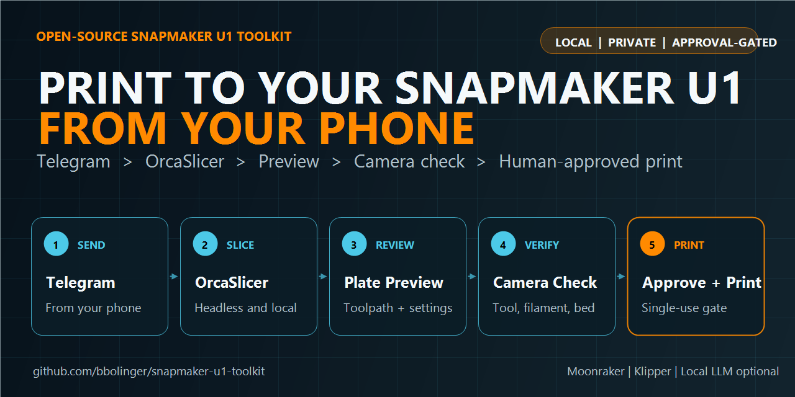

# Print to Your Snapmaker U1 From Your Phone

Snapmaker U1 Toolkit is an open-source remote printing workflow for the Snapmaker U1. Send an STL, 3MF, or multi-part ZIP through Telegram; slice it locally with OrcaSlicer; review the plate, toolpath, and settings; verify the printer with a fresh camera photo; then approve the exact job from your phone.

[View the project on GitHub](https://github.com/bbolinger/snapmaker-u1-toolkit) · [Print-from-phone guide](PRINT-FROM-PHONE.html) · [Installation](https://github.com/bbolinger/snapmaker-u1-toolkit#install)

## From model to monitored print

- **Send from your phone:** attach one model or a ZIP of parts in Telegram.
- **Slice locally:** run upstream OrcaSlicer headlessly on your own Linux, WSL, or Windows host.
- **Review the real job:** inspect orientation, plate layout, G-code-derived previews, and the important print settings.
- **Verify the U1:** check the loaded toolhead and filament, then inspect a fresh onboard-camera image of the bed.
- **Approve deliberately:** a single-use approval bound to the job and operator starts the countdown.
- **Monitor remotely:** receive first-layer, last-layer, pause/resume, and completion photos.

## Designed for the Snapmaker U1

The toolkit understands the U1's toolchanger, Snapmaker profiles, OrcaSlicer CLI behavior, Moonraker storage, camera, thumbnails, and multi-plate workflows. It can rewrite the selected tool, validate G-code bounds, detect profile drift, and refuse a start when printer state no longer matches the reviewed plan.

## Remote printing without unrestricted AI control

Hermes and a local LLM are optional chat layers. They can help explain choices and relay workflow events, but they do not receive a general-purpose print-start command. Deterministic toolkit code owns printer checks, upload-only behavior, the fresh-camera approval prompt, the single-use start gate, and the cancel window.

[Read the safety model](SAFETY.html)

## Choose your setup

### Print from your phone with Telegram

Use Hermes as the Telegram bridge and keep model processing on local hardware.

[Follow the phone-printing guide](PRINT-FROM-PHONE.html) · [Configure Telegram](TELEGRAM-SETUP.html)

### Run headless OrcaSlicer without AI

Use the command-line tools directly for scripted slicing, previews, G-code validation, Moonraker uploads, and monitoring.

[Set up headless OrcaSlicer for the Snapmaker U1](HEADLESS.html)

### Build another frontend

Consume the toolkit's JSON event stream or reuse the platform-neutral form contract to integrate a different chat bot, web interface, or automation system.

[Read the event contract](events.html) · [View the adapter examples](https://github.com/bbolinger/snapmaker-u1-toolkit/tree/main/adapters)

## Quick answers

### Can I print to a Snapmaker U1 from my phone?

Yes. With the Hermes Telegram integration installed, you can submit the model, choose settings, review artifacts, inspect the bed photo, and approve the prepared job from a private Telegram chat.

### Does it require cloud slicing?

No. OrcaSlicer and the optional local LLM run on your own host. The printer is addressed through its LAN Moonraker interface.

### Can I use the toolkit without Hermes or an AI model?

Yes. The slicing, preview, validation, upload, camera, status, monitoring, and audit tools are ordinary Python CLIs.

### Will it start a print automatically?

No. Toolkit-started prints require an explicit human approval tied to a fresh bed photo and the current prepared G-code. If the plan, operator, or printer state does not match, the gate refuses.

---

[GitHub repository](https://github.com/bbolinger/snapmaker-u1-toolkit) · [Troubleshooting](https://github.com/bbolinger/snapmaker-u1-toolkit/blob/main/TROUBLESHOOTING.md) · [Releases](https://github.com/bbolinger/snapmaker-u1-toolkit/releases)

